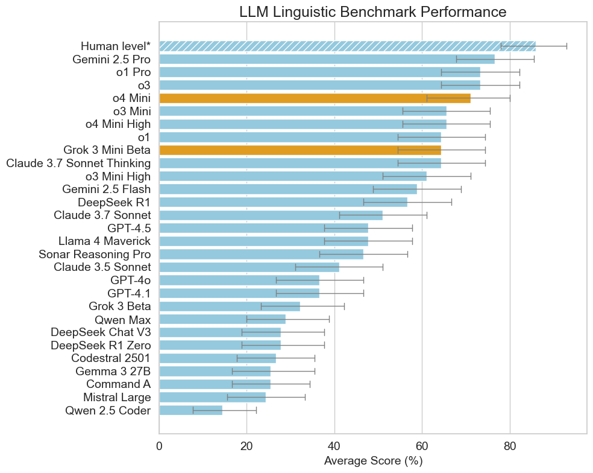
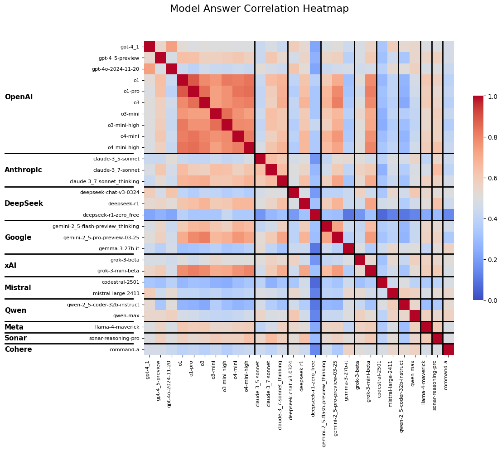
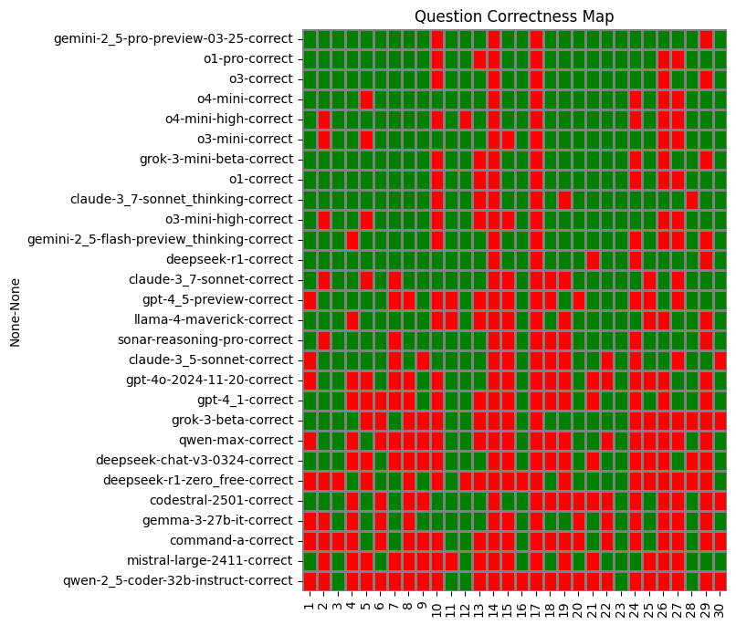
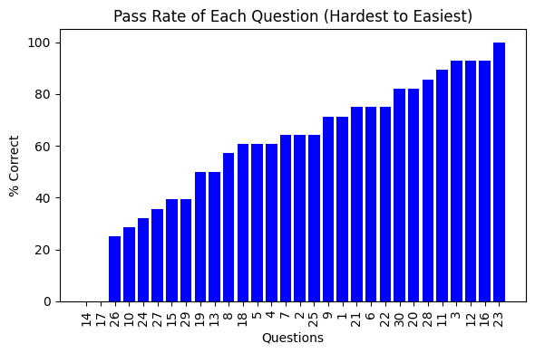

# README

# Code for "Easy Problem That LLMs Get Wrong" Paper

ArXiv Paper: [https://arxiv.org/abs/2405.19616]()

### Benchmark Results

[2024-07-20-Multi-Benchmark ](https://github.com/autogenai/easy-problems-that-llms-get-wrong/tree/e5d6baa16e221205ef90f0833e9ca3c30b08f713/2024-07-20-Multi-Benchmark)



*Orange highlighted are the most cost effecitve.

### Benchmark Multi-choice Questions (Hardest to easiest)

Question 14 of 30:

A group of four people needs to cross a bridge at night. The bridge is very old and rickety. They have only one torch and because it's night-time, the torch is necessary to cross the bridge. Each person walks at a different speed: - A takes 1 minute to cross, - B takes 2 minutes, - C takes 5 minutes, and - D takes 10 minutes. What is the fastest time they can all get across the bridge?

Possible Answers:
A. 14 minutes
B. 10 minutes
C. There is not enough information to determine the fastest time.
D. 17 minutes

Correct Answer:
B. 10 minutes

AI Pass Rate: 0.00%

---

Question 17 of 30:

The Poisoned Wine - A king has 1000 sweet bottles of wine, and one contains a very bitter poison. The poison takes effect exactly 24 hours after consumption. The king needs to find the poisoned bottle in 24 hours for an event. He has 10 prisoners to test the wine. What is the fastest way for him to identify the poisoned bottle?

Possible Answers:
A. Using a binary search strategy with the 10 prisoners, leveraging the concept of binary numbers to minimize the number of tests needed. The king will know results in 24 hours
B. Divide the bottles of wine amongst the prisoners and get them to take a sip and note which one dies in 24 hours.
C. Divide the bottles of wine amongst the prisoners and get them to note which one tastes bitter.
D. Get all of the prisoners to sample each of the bottles of wine and see who dies in 24 hours.

Correct Answer:
C. Divide the bottles of wine amongst the prisoners and get them to note which one tastes bitter.

AI Pass Rate: 0.00%

---

Question 26 of 30:

A runaway trolley is heading down the tracks away from five people upwards of the track. You are near a lever that can switch the trolley to another track? How might pulling the lever impact the five people's lives?

Possible Answers:
A. Pulling the lever will take their lives.
B. It doesn't impact their lives.
C. Pulling the lever will save their lives.
D. This is an ethical dilemma.

Correct Answer:
B. It doesn't impact their lives.

AI Pass Rate: 25.00%

---

Question 10 of 30:

I get out on the top floor (third floor) at street level. How many stories is the building above the ground?

Possible Answers:
A. Three stories above the ground
B. One story above the ground
C. Two stories above the ground
D. Zero stories above the ground

Correct Answer:
B. One story above the ground

AI Pass Rate: 28.60%

---

Question 24 of 30:

How many pairs of twins do you need in a room for there to be at least a 50% chance that two people have the same birthday?

Possible Answers:
A. 12 pairs
B. 1 pair
C. 46 pairs
D. 23 pairs

Correct Answer:
B. 1 pair

AI Pass Rate: 32.10%

---

Question 27 of 30:

How do you efficiently measure exactly 4 gallons of water with only a 3-gallon, 5-gallon, 4-gallon, and 2-gallon jug?

Possible Answers:
A. Filling the 2-gallon jug, twice.
B. Another option not stated.
C. Filling the 5-gallon jug and pouring it into the 4-gallon jug.
D. Filling the 5-gallon jug and pouring it into the 3-gallon jug, twice.

Correct Answer:
B. Another option not stated.

AI Pass Rate: 35.70%

---

Question 15 of 30:

You're in a room with two doors that lead out. One door leads to certain death, and the other door leads to freedom. There are two guardians, one by each door. One taller guardian always tells the truth and guards the death door, the other always lies. What is the minimum number of questions needed to ask the guards to get to safety?

Possible Answers:
A. Zero questions
B. One question
C. The door leading to freedom can never be determined.
D. Two questions

Correct Answer:
A. Zero questions

AI Pass Rate: 39.30%

---

Question 29 of 30:

A man steps over a 0.5m hurdle. What is the minimum height he could have jumped?

Possible Answers:
A. 0m
B. 0.5m
C. Slightly higher than 0.5m
D. Between 0.1m and 0.5m

Correct Answer:
A. 0m

AI Pass Rate: 39.30%

---

Question 19 of 30:

An arrow points up. We rotate it 90 degrees to the left, mirror it along its flat end, and rotate it another 90 degrees to the left. Which direction is it pointing?

Possible Answers:
A. Left
B. Right
C. Down
D. Up

Correct Answer:
D. Up

AI Pass Rate: 50.00%

---

Question 13 of 30:

A man leaves home at 0m elevation, makes a left turn and walks straight for a km and reaches 300m elevation, makes another left turn and walks straight for a km and reaches 500m elevation, makes another left turn and walks straight for a km and reaches 900m elevation, and turns left again and walks straight for a km. How far away is he from his starting point and what is his final elevation?

Possible Answers:
A. 0m from starting point, 1700m elevation.
B. We cannot accurately determine his final position and elevation.
C. 2000m from starting point, 900m elevation.
D. 0m from starting point, 0m elevation.

Correct Answer:
D. 0m from starting point, 0m elevation.

AI Pass Rate: 50.00%

---

Question 8 of 30:

Write me a sentence without any words that appear in The Bible

Possible Answers:
A. The computer swiftly executed complex algorithms.
B. Our computer, engineered in a contemporary lab, processes data flawlessly and efficiently.
C. Cryptographic algorithms safeguard nuclear warheads.
D. Quixotic zephyrs vexed the jabberwocky's kumquat garden.

Correct Answer:
C. Cryptographic algorithms safeguard nuclear warheads.

AI Pass Rate: 57.10%

---

Question 18 of 30:

Write a grammatically correct sentence without reusing any letter more than once.

Possible Answers:
A. No such sentence is possible.
B. 'Dogs bark with me.'
C. 'The quick brown fox jumps over the lazy dog.'
D. 'The five boxers jog quick.'

Correct Answer:
B. 'Dogs bark with me.'

AI Pass Rate: 60.70%

---

Question 5 of 30:

Bob has three boxes in front of him - Box A, Box B and Box C. Bob does not know what is in the boxes. Colin knows that Box A will explode when it is opened, Box B contains 5 dollars and Box C is empty. Should Bob open a box? What box should Bob open?

Possible Answers:
A. No, Bob should not open any box
B. Yes, Box A
C. Yes, Box C
D. Yes, Box B

Correct Answer:
A. No, Bob should not open any box

AI Pass Rate: 60.70%

---

Question 4 of 30:

A farmer wants to cross a river and take with him a wolf, a goat and a cabbage. He has a boat with three secure separate compartments. If the wolf and the goat are alone on one shore, the wolf will eat the goat. If the goat and the cabbage are alone on the shore, the goat will eat the cabbage. What is the minimum number of crossings the farmer needs to make to bring the wolf, the goat and the cabbage across the river without anything being eaten?

Possible Answers:
A. The animals are not able to be transported across the river without being eaten.
B. Five crossings
C. Seven crossings
D. One crossing

Correct Answer:
D. One crossing

AI Pass Rate: 60.70%

---

Question 7 of 30:

Alan, Bob, Colin, Dave and Emily are standing in a circle. Alan is on Bob's immediate left. Bob is on Colin's immediate left. Colin is on Dave's immediate left. Dave is on Emily's immediate left. Who is on Alan's immediate right?

Possible Answers:
A. 'Dave'
B. 'Bob'
C. 'Emily'
D. No one

Correct Answer:
B. 'Bob'

AI Pass Rate: 64.30%

---

Question 2 of 30:

Suppose you're on a game show, and you're given the choice of three doors: Behind one door is a gold bar; behind the others, rotten vegetables. You pick a door, say No. 1, and the host asks you 'Do you want to pick door No. 2 instead?' What choice of door now gives you the biggest advantage?

Possible Answers:
A. Door No.2
B. Door No.3
C. They have equal probability of winning
D. Door No.1

Correct Answer:
C. They have equal probability of winning

AI Pass Rate: 64.30%

---

Question 25 of 30:

A partially full hotel has an infinite number of fully furnished rooms. How does it accommodate one more guest?

Possible Answers:
A. You cannot accommodate one more guest.
B. You ask each current guest to move to the next room.
C. You ask each current guest to move to the room number n*2.
D. By putting the guest in an empty room.

Correct Answer:
D. By putting the guest in an empty room.

AI Pass Rate: 64.30%

---

Question 9 of 30:

Which weighs more, a pound of water, two pounds of bricks, a pound of feathers, or three pounds of air.

Possible Answers:
A. Two pounds of brick.
B. Three pounds of air.
C. They all weigh the same.
D. A pound of feathers.

Correct Answer:
B. Three pounds of air.

AI Pass Rate: 71.40%

---

Question 1 of 30:

You have six horses and want to race them to see which is fastest. What is the minimum number of races needed to do this?

Possible Answers:
A. One
B. Three
C. Two
D. Unknown

Correct Answer:
A. One

AI Pass Rate: 71.40%

---

Question 21 of 30:

Sally (a girl) has 3 brothers. Each brother has 2 sisters. How many sisters does Sally have?

Possible Answers:
A. One
B. Hard to know
C. Two
D. Three

Correct Answer:
A. One

AI Pass Rate: 75.00%

---

Question 6 of 30:

A robot has 8 arms. There are 5 objects on a table: a knife, a fork, a spoon, a teddy bear and a doll. The robot picks up each object with an arm. He then shakes hands with himself. How many arms does he have free?

Possible Answers:
A. 2
B. 0
C. 1
D. Other

Correct Answer:
C. 1

AI Pass Rate: 75.00%

---

Question 22 of 30:

I'm in London and facing west, what direction is Edinburgh?

Possible Answers:
A. Behind you
B. Right
C. Straight ahead
D. Left

Correct Answer:
B. Right

AI Pass Rate: 75.00%

---

Question 30 of 30:

I walk to my friend's house, averaging 3mph. How fast would I have to run back to double my average speed for the entire trip?

Possible Answers:
A. 12mph
B. 6mph
C. 9mph
D. Infinitely fast

Correct Answer:
D. Infinitely fast

AI Pass Rate: 82.10%

---

Question 20 of 30:

Write a sentence where every word starts with the letter A.

Possible Answers:
A. Apples and apricots are always an amazing afternoon snack.
B. The aardvark adored and amazing, appetizing apron.
C. Alice ate an apple after an argument.
D. Alligators always avoid angry ants aggressively attacking two apples.

Correct Answer:
C. Alice ate an apple after an argument.

AI Pass Rate: 82.10%

---

Question 28 of 30:

A 2kg tree grows in a planted pot with 10kg of soil. When the tree grows to 3kg, how much soil is left?

Possible Answers:
A. 10kg
B. 8kg
C. 11kg
D. 9kg

Correct Answer:
A. 10kg

AI Pass Rate: 85.70%

---

Question 11 of 30:

In a toy box, there's a red ball, a blue truck, and a green dinosaur. The red ball is not next to the blue truck, and the green dinosaur is next to the red ball. Which toy is in the middle?

Possible Answers:
A. 'The red ball'
B. 'The blue truck'
C. 'The green dinosaur'
D. None of them are positioned in the middle.

Correct Answer:
C. 'The green dinosaur'

AI Pass Rate: 89.30%

---

Question 3 of 30:

You are playing Russian roulette with a six-shooter revolver. Your opponent puts in five bullets, spins the chambers and fires at himself, but no bullet comes out. He gives you the choice of whether or not you should spin the chambers again before firing at yourself. Should you spin?

Possible Answers:
A. Yes, you should spin again
B. It makes no difference if you spin again or not
C. The probabilities are random and unknown
D. No, you should not spin again

Correct Answer:
A. Yes, you should spin again

AI Pass Rate: 92.90%

---

Question 12 of 30:

Four children - Alex, Bella, Charlie, and Dana - are sitting around a picnic table. Alex is facing Bella. Charlie is sitting to the right of Bella. Who is sitting to the left of Alex?

Possible Answers:
A. 'Charlie'
B. 'Dana'
C. No one
D. 'Bella'

Correct Answer:
B. 'Dana'

AI Pass Rate: 92.90%

---

Question 16 of 30:

You have 3 switches in front of you - A, B and C. You have 3 light bulbs in front of you in the same room - one red, one blue, one purple. They are LED and do not get warm when turned on. You want to know which switch turns on which light bulb. What is the best way to determine this?

Possible Answers:
A. Turing each switch on one at a time and observing the bulbs.
B. Turing two switches on for a while, turn one off, then touching the bulbs too see which is warm and which one is one.
C. You must walk into another room to observe the bulbs.
D. Turing all of the switches on at once and observing the bulbs.

Correct Answer:
A. Turing each switch on one at a time and observing the bulbs.

AI Pass Rate: 92.90%

---

Question 23 of 30:

Count the number of occurrences of the letter 'L' in the word 'LOLLAPALOOZA'.

Possible Answers:
A. Two
B. Five
C. Four
D. Three

Correct Answer:
C. Four

AI Pass Rate: 100.00%

---

## Other relevant charts







## Details

### **Hotz-Reflection**

[Description - LinkedIn Post](https://www.linkedin.com/posts/heikohotz_%3F%3F%3F%3F%3F%3F%3F-%3F%3F%3F%3F%3F%3F%3F-%3F%3F%3F%3F-%3F-activity-7209092819909517312-He-r?utm_source=share)

**Basic prompt template**

```
f"""
{question["multi_choice_question"]}

INITIAL ANSWER
{question["model_answer"]}

REFLECTION TASK
Review the question carfully and assess your initial answer. You can amend the answer if you wish too, otherwise return the original answer. Return in JSON format, for example:
{{"ANSWER": {random.choice(['A','B','C','D'])}}}
"""
```

**Results**

[Full JSON results](https://github.com/autogenai/easy-problems-that-llms-get-wrong/tree/c4ae6be53df49307c81803af0b5d24e19ea983f5/2024-06-21-Multi-Benchmark%20(temp%3D0)/auto_eval_hotz_outputs)


## LLM Linguistic Benchmark Tool

This tool facilitates benchmarking and statistical analysis of various Language Learning Models (LLMs) against a set of linguistic benchmark questions. It encapsulates functionalities to asynchronously query different LLMs, evaluate their responses, and perform statistical analysis to gauge the performance of each model.

### Features

- **LLM Query Interface:** Interface to send queries to different LLMs like OpenAI's GPT models, Mistral, etc.
- **Asynchronous Processing:** Batch processing of queries to LLMs for efficient data handling.
- **Benchmark and Evaluation:** Load benchmark questions, obtain model responses, and evaluate them according to a predefined rubric.
- **Statistical Analysis:** Calculate mean scores, standard deviations, and confidence intervals of model performances.
- **Visuals:** Correlation and hardest question charts with performance-correlation.ipynb

### Installation

First, clone this repository to your local machine:

```shell
git clone https://yourrepositoryurl.git
cd language-model-benchmark-tool
```

Then, install the required Python packages:

```shell
pip install -r requirements.txt
```

### LLM API Access

To access the various LLM services you will need valid API keys and credentials.

Place them in an `.env` file in the project root (use `.env copy` as a template):

```
OPENAI_API_KEY=your_openai_api_key_here
COHERE_API_KEY=your_cohere_api_key_here
MISTRAL_API_KEY=your_mistral_api_key_here
ANTHROPIC_API_KEY=your_anthropic_api_key_here
OPENROUTER_API_KEY=
....
```

See [LiteLLM](https://github.com/BerriAI/litellm?tab=readme-ov-file#supported-providers-docs) for more details on how to set up for various LLM providers.

### Usage

To run the benchmark tool, jump into the `main.ipynb` notebook and run all of the cells.

Make changes to the #Variables notebook cell, which includes:

- LLM models to test
- Model hyperparameters
- Method of answer evaluation
- Whether to include reflection
- The various save paths
- The exectution steps to conduct (perhaps you only want to get answers, for example)

Ultimately, this will process the benchmark questions, query the LLMs, analyse the responses, and output the statistical summary and graph.

### Most Accurate Results

The multiple-choice questions are the most determinitistic and the more reliable to evaluate, as there is a clear set answer to measure against; however, open-ended questions can often expose illogical and inconsistent behavior more reliably, but are difficult to evalutate.

For open-ended questions (non multiple choice) it is best for a person to mark the LLM responses so as not to rely on the scores auto-generated in the `auto_eval_outputs` folder (by default marked by GPT-4o). You can edit the scores in the  `auto_eval_outputs` json files directly and then re-run the "generate_statistics" execution step in the  `main.ipynb` notebook to get the final results. This is how the authors did it for the paper, resulting in much lower scores than the less reliable LLM based auto evaluation.

### Modifying the Benchmark Questions

The Benchmark can be modified or extended by editing the [linguistic_benchmark.json](https://github.com/autogenai/easy-problems-that-llms-get-wrong/blob/e5d6baa16e221205ef90f0833e9ca3c30b08f713/linguistic_benchmark.json) file and [linguistic_benchmark_multi_choice.json](https://github.com/autogenai/easy-problems-that-llms-get-wrong/blob/e5d6baa16e221205ef90f0833e9ca3c30b08f713/linguistic_benchmark_multi_choice.json) in the root directory. Ensure the format remains consistent with existing entries.

### Future Work and Limitations

There are vast limitations to this approach, but further improvements might include:

* [X] Using multiple-choice questions to make evaluation more reliable.
* [X] Running inference multiple times with the temperature for each model set above zero
  (standardised and equivalent across all architectures) and generating aggregate statistics.
* [X] Building in "Hotz Reflection" to allow the model to reflect and potentially change its answer.
* [ ] Expanding the Linguistic Benchmark beyond thirty questions to increase statistical significance and test a more diverse range of inputs.
* [ ] Testing on a sample of smaller LLMs to see if performance is correlated to model size.
* [ ] Fine-tuning models with a training dataset of perturbed variations of well-known logictype problems found in the training corpora (on the internet) to see if this decreases
  overfitting variance.
* [ ] Testing advanced regularisation techniques for LLMs during the pre-training process.
* [ ] Finding better methodologies to keep LLM outputs deterministic.
